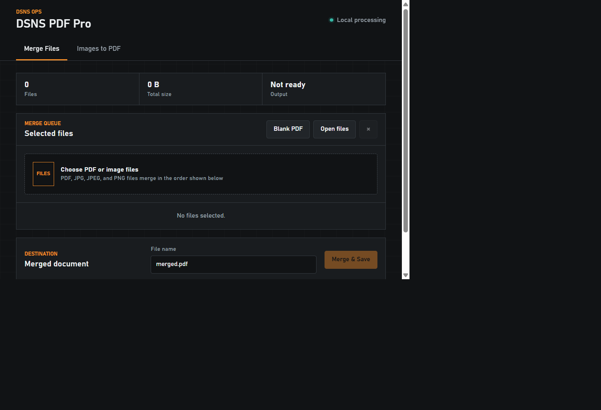

# DSNS PDF Pro

[](https://github.com/sden316/dsns-pdf-pro/actions/workflows/ci.yml)
[](LICENSE.txt)
[](https://www.python.org/)

Lightweight local Flask application for merging PDF and image files, converting images to PDF, and generating a blank PDF page. Its visual language matches Grafana Migration Verifier.

The project lives at `Productivity/projects/pdf-pro` and displays **DSNS OPS** branding in the application header.



## Features

- **Merge Files** combines PDF, JPG, JPEG, and PNG files in one ordered queue.
- **Images to PDF** converts one or more JPG, JPEG, or PNG images into a PDF.
- **Blank PDF** creates a single-page blank portrait A4 document without requiring an input file.
- **Merge Files** requires at least two files; **Images to PDF** requires at least one image.
- Reorder or remove files independently in either tab. Queues and output names are retained when switching tabs.
- Configure image page size, orientation, margins, fit mode, and transparent-pixel background.
- Apply EXIF orientation automatically before conversion.
- Merge entirely through the local Flask process without retaining uploads.
- Choose the output filename and destination for merged and converted documents with Microsoft Edge's native save picker. Blank documents use `blank.pdf` as the suggested name.
- Fall back to a normal browser download when the File System Access API is unavailable.

## Usage

- Select **Merge Files**, add at least two PDF or image files, arrange them in output order, choose a filename, and select **Merge & Save**.
- Select **Images to PDF**, add one or more images, configure the page layout, choose a filename, and select **Convert & Save**.
- Select **Blank PDF** from either tab to create and save one blank portrait A4 page as `blank.pdf`.

## Image layout

The **Images to PDF** defaults are A4, automatic orientation, 8 mm margins, fit inside page, and white background. Available page sizes are A4, Letter, and the image's physical size. **Fill page** preserves aspect ratio but crops overflow at the page edges.

Images added to **Merge Files** use image-sized pages with automatic orientation, no margins, contain fit, and a white background. Existing PDF pages are preserved unchanged.

Animated or multi-frame images and password-protected PDFs are rejected with an explanatory message.

## Prerequisites

- Windows with Python 3.11 or later.
- Microsoft Edge for the native output-location picker. Other browsers fall back to their normal download behavior.

## Privacy and security

- The server binds to `127.0.0.1` by default.
- Uploaded documents are processed in memory and are not intentionally persisted by the application.
- Files are sent only between your browser and the local Flask process.
- The Flask development server is for local use only. Do not expose it directly to untrusted networks or use it as a production server.
- Avoid processing untrusted files unless you understand the risk inherent in parsing complex document and image formats.

## Start

```powershell
py -m pip install -r requirements-dev.txt
.\start.ps1
```

Open <http://127.0.0.1:8090>.

`start.ps1` stops any process already listening on the selected port before starting the app. Set `PORT` to use a port other than `8090`.

The default combined upload limit is 500 MB. Override it with `PDF_PRO_MAX_BYTES` before starting the app. Files are processed in memory and are not written to server-side storage.

## Tests

```powershell
py -m pytest -q
```

## Contributing

Contributions are welcome. Review [CONTRIBUTING.md](CONTRIBUTING.md), the [Code of Conduct](CODE_OF_CONDUCT.md), and [SECURITY.md](SECURITY.md) before opening an issue or pull request.

## Author

Created and maintained by [Srini Denduluri](https://github.com/sden316).

## License

Licensed under the [MIT License](LICENSE.txt).
